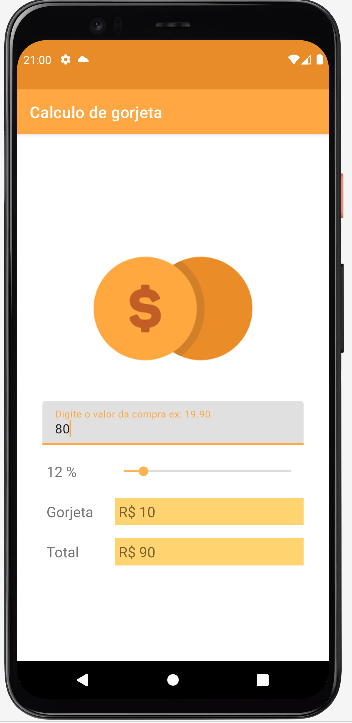

# Apresentação

Este é um aplicativo desenvolvido para calcular o valor estimado a pagar da gorjeta ao garçom.
Eu desenvolvi ele para aperfeiçoamento de conhecimento em aplicativos nativos para Android com exploração de componentes disponiveis no Android Studio.

## Recursos explorados no desenvolvimento do APP

* Utilização dos campos textInputlayout.
* Utilização de Seekbar para definição do percentual para calculo.
* Definição de evento OnSeekBarChanged do Seekbar em código.
* Arredondamentos de valores.
* Notificação por Toast para erro de validação de campo.

## Requisitos

* Gradle [https://gradle.org/](https://gradle.org/).
* Java.
* Android Studio mais recente, utilizado a versão Node ultima versão.
* Adb Devices, emulador ou aparelho fisico.

